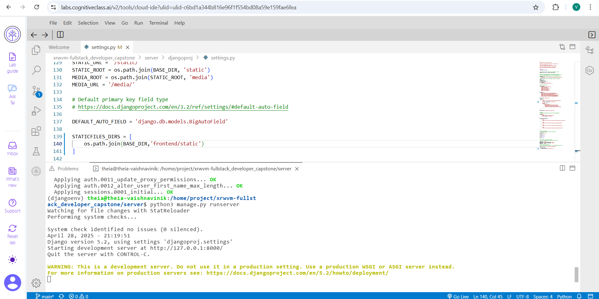
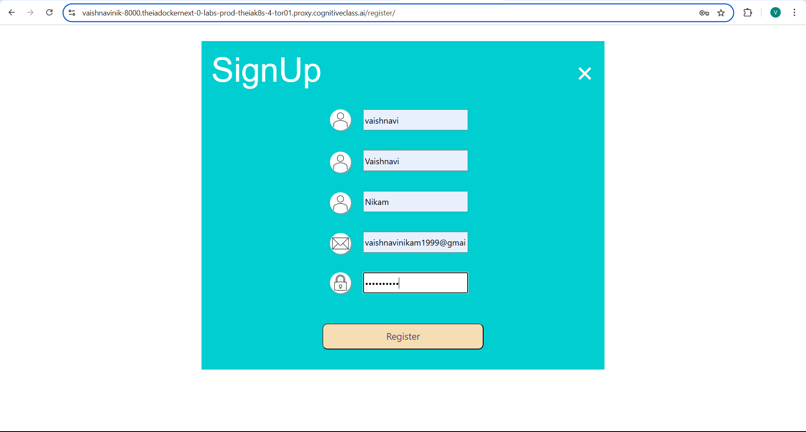
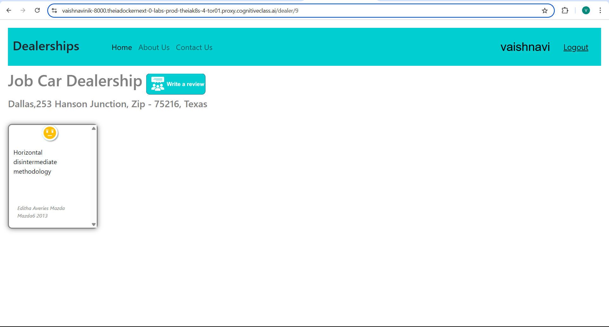
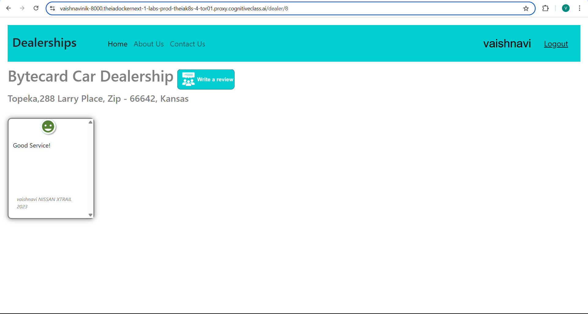

# Full Stack Application Development Capstone Project - Car Dealership Review Platform

## Overview

This project is the final capstone assignment for the **IBM Full Stack Software Developer Professional Certificate** course. It simulates a real-world scenario where you work as a Lead Cloud Application Developer to build a web-based platform for managing car dealership information and customer reviews.

The platform enables users across the United States to:

* Browse dealerships by state
* Read and post reviews about dealerships
* View detailed information about each dealer
* Register and authenticate using a secure system

The application is built using Django for the backend, Express.js and MongoDB for dealership and review APIs, and React for the frontend interface. The system is containerized using Docker and deployed with Kubernetes, ensuring scalability and flexibility across cloud platforms.

## Project Phases

### 1. **Static Pages & Django Setup**

* Fork and clone the GitHub repository
* Run the Django app locally<details><summary>[ View Screenshot]</summary></details>
* Add Bootstrap-based navigation
* Implement "About Us" and "Contact Us" static pages<details><summary>[View Screenshot ]</summary>.png) .png)</details>

### 2. **User Management**

* Create a Django superuser<details><summary>[View Screenshot]</summary>.png)</details>
* Add login, logout, and registration views<details><summary>[View Screenshot]</summary> .png) </details>
* Configure client-side authentication flows

### 3. **Express API Services with MongoDB**

* Develop Node.js Express endpoints:

  * `/fetchReviews/dealer/:id`<details><summary>[View Screenshot]</summary></details
  * `/fetchDealers`<details><summary>[View Screenshot]</summary></details>
  * `/fetchDealer/:id`<details><summary>[View Screenshot]</summary></details>
  * `/fetchDealers/:state`<details><summary>[View Screenshot]</summary></details>
* Containerize the backend API with Docker
* Use MongoDB for storing dealer and review data

### 4. **Django Models & Views for Car Inventory**

* Define `CarMake` and `CarModel` Django models
* Register models in Django Admin<details><summary>[View SCreenshot]</summary> </details>
* Create and associate car entries with dealers
* Implement Django proxy views to consume Express APIs

### 5. **React Frontend**

* Create `Dealers` component to list all dealers<details><summary>[View Screenshot]</summary></details>
* Create `Dealer` component to display detailed dealer info and reviews<details><summary>[View Screenshot]</summary></details>
* Implement review submission page with sentiment analysis feedback<details><summary>[View Screenshot]</summary>  </details>

### 6. **CI/CD with GitHub Actions**

* Understand the provided CI/CD workflow<details><summary>[View Screenshot]</summary></details>
* Enable GitHub Actions
* Run Linting and test workflows for consistent code quality

### 7. **Containerization & Kubernetes Deployment**

* Build Docker images for Django and Express apps
* Write Kubernetes manifests for deployments and services
* Deploy and manage the application using Kubernetes on IBM Code Engine or other platforms<details><summary>[View Screenshot]</summary>  </details>

## Technologies Used

* **Backend**: Django, Express.js, MongoDB
* **Frontend**: React.js, Bootstrap
* **APIs**: RESTful endpoints for dealerships and reviews
* **DevOps**: Docker, Kubernetes, GitHub Actions
* **Other Tools**: SQLite, dotenv, gunicorn

## Getting Started

### Prerequisites

* Python 3.11+
* Node.js
* Docker & Docker Compose
* Kubernetes CLI (`kubectl`)

### Setup Instructions

```bash
# Clone the repository
$ git clone https://github.com/<your-username>/best-cars-dealership.git
$ cd best-cars-dealership

# Backend setup (Django)
$ cd server
$ python manage.py makemigrations
$ python manage.py migrate
$ python manage.py runserver

# Mongo backend setup
$ cd server/database
$ docker-compose up --build

# Frontend setup
$ cd frontend
$ npm install
$ npm start
```

## License

This project is part of the IBM Full Stack Software Developer Capstone Course and is intended for educational purposes.

## Authors

* czhao-dev (Lead Developer)
* IBM Skills Network Capstone Team# coding-project-template
